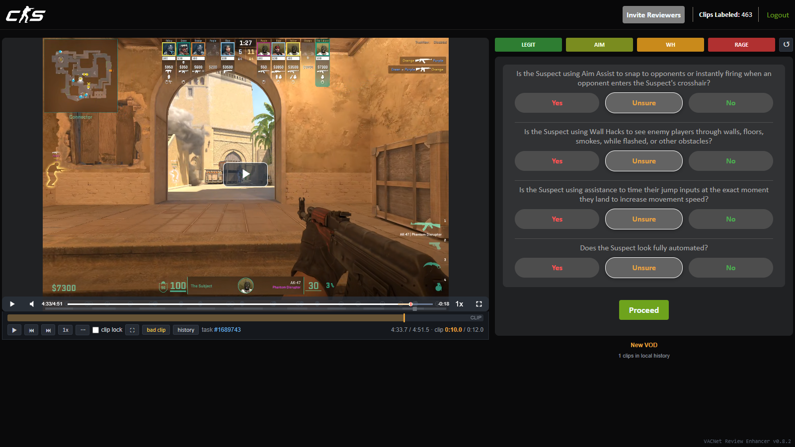
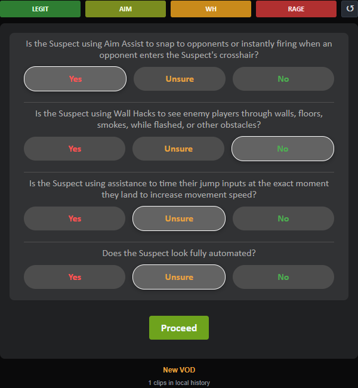
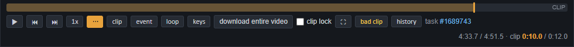
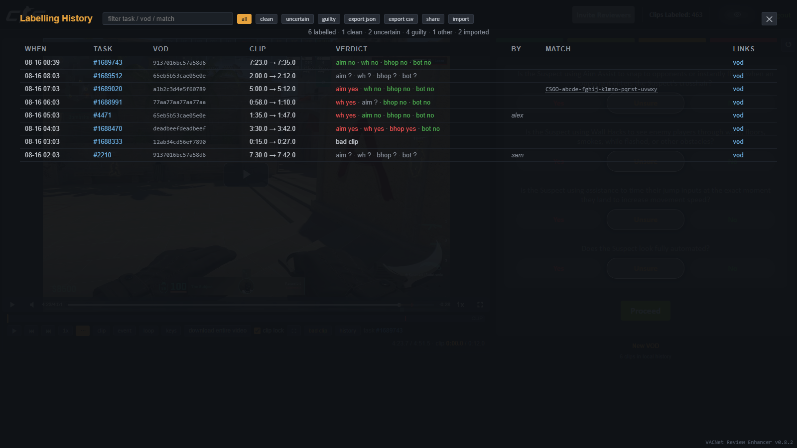

# VACNet Review Enhancer

 Opens the raw userscript. With <a href="https://www.tampermonkey.net">Tampermonkey</a> or <a href="https://violentmonkey.github.io">Violentmonkey</a> installed it shows an install prompt. If you just see code, the manager is not installed or is not detecting it.

A userscript that turns the CS2 VACNet labelling portal (`counter-strike.net/vacnet/clips`) into a fast, keyboard-driven review tool: full-VOD seeking, colour-coded one-key verdicts and presets, labelling without leaving fullscreen, no page reload between clips, a persistent history archive, and shareable labels for reviewing as a group.

> ⚠️ **This is a productivity tool, not an automation tool.** It does not auto-answer or "farm" labels to earn invites for your friends/family/mother/father/sister/brother. Its only real use is to make watching and clicking faster.
>
> 🙏 **Do not let anything outside the Valve-assigned clip window influence your verdict.** For example, a player may toggle earlier in the match, but if the 10-12 second clip you were given does not show it, labelling on that outside knowledge mislabels the clip.

## Install

1. Install [Tampermonkey](https://www.tampermonkey.net) or [Violentmonkey](https://violentmonkey.github.io).
2. Click **INSTALL NOW** above (or open [`vacnet-enhancer.user.js`](vacnet-enhancer.user.js) and press **Raw**); your script manager shows an install prompt. Fallback: create a new script and paste the file contents.
3. Open the portal. The wide two-column layout kicks in above 1400px window width.

It keeps itself current: the version tag in the bottom-right corner turns green (`⬆ update available`) when a newer build is on GitHub, and clicking it reinstalls. Tampermonkey's own "check for updates" works too.

## Features

### Full-VOD player

The portal normally clamps playback to the ~10s assigned clip and snaps you back if you scrub outside it. The script removes that clamp at page load, so the native seekbar covers the entire demo, and marks it up:

- **orange band** = the assigned clip, **red tick** = the event moment, **green bands** = parts of this VOD you already labelled.
- a **clip bar** under the video with its own scrubber, transport, a playback rate dropdown (0.1x to 4x, picked in one click), task id/link and match id.
- **clip lock** — a checkbox that puts the original clip-only behaviour back if you'd rather not stray past the demo; it persists across clips.
- **out-of-clip warning** — an amber banner appears whenever playback leaves the assigned window; click it to jump back to the clip start.

### One-key verdicts

Each question becomes colour-coded **Yes / Unsure / No**, driveable entirely from the keyboard, with preset buttons and hotkeys for the common calls (LEGIT, AIM, WH, RAGE) plus a reset.

### Label without leaving the video

The verdict column is not on screen in fullscreen, so the questions come with you: a panel over the video with Yes / Unsure / No per question, and proceed / back. It mirrors the real radios, so answering there is the same as answering in the column.

### No reload between clips

Submitting normally reloads the whole page. Instead the verdict form is posted in the background and the next clip is swapped into the running page: fullscreen survives, and so does your playback position. The player is covered while that is in flight so it is clear something is happening, and the next clip starts playing from its own clip start rather than inheriting where you left the last one. Everything the next clip touches is replaced together, so the form can never be holding one task while the player shows another. If the post fails or comes back with anything unexpected, it falls back to the normal navigation rather than guessing; you can also turn it off in settings.

### Scrub previews

Hovering the native seek bar shows a preview frame and its timestamp, decoded in a second detached video. One frame per second is cached, and only one decode is ever in flight, so dragging across the bar does not queue up a hundred seeks.

### Knowing what you actually watched

The bar shows how much of the assigned clip you have played, and flags it in red until you have played through the flagged moment itself. If you answer anything other than Uncertain without having watched that moment, confirming asks you once whether you are sure. Coverage is stored with each label, so the archive shows the same for past clips. Turn it off in settings if you don't want it.

### Settings

Press **`s`**. Every amount the script uses is editable and persisted: seek steps, run-up distances, slow-mo rate and lead-in, rate limits and step, frame-step fps, history cap. Toggles for the coverage warning, scrub previews and no-reload advance.

It also carries a **page hooks** health check. Every assumption the script makes about Valve's HTML is declared in one place and resolved on demand, so when the portal changes, the broken hook is listed here instead of a feature silently doing nothing.

### Control bar

Everything you need sits under the video. The `⋯` button hides or reveals the extra controls (clip, event, loop, keys, download entire video) so the bar stays uncluttered; the choice is remembered.

### History & archive

Every submission is logged to `localStorage`. A "seen before" panel lists your past verdicts for this replay, and clicking one re-applies that verdict to the current questions.

Clips are identified by replay plus event timestamp rather than task id, because the portal re-serves the same moment under a new task id. So the panel separates **this exact clip, labelled before** from **same replay, other moments** — the first is what you said about this very clip, the second is a different moment of the same match and much weaker evidence. Press **`a`** for the full archive: a filterable, sortable table of every task you've labelled, with per-question verdicts, match id, links, and JSON/CSV export.

### Share & review as a group

`share` exports your labels stamped with a name you choose; `import` merges a teammate's file. Imported verdicts appear with their name (in grey) in the seen-before panel, as blue bands on the timeline, and in a `by` column in the archive — kept in a separate store so your own stats stay clean. A group export bundles everyone's labels with each contributor's name preserved, so a single file can carry the whole team and be relayed onward without losing attribution.

### Imported files are treated as untrusted

An import is JSON somebody else wrote, opened on a page that holds your live portal session. Every entry is rebuilt on the way in from only the fields that get used, as the types they are meant to be: labels must match the portal's own label format, ids must look like ids, and links must be `http(s)` — a `javascript:` link is dropped. Anything else in the file never reaches storage. Records are escaped again when they are drawn, so a store poisoned by an older version stays inert.

### Privacy

Your reviewer name in the portal header is masked — blurred, clipped to a fixed width so its length doesn't leak, with an eye icon over it — to keep it out of screenshots and streams. Hover to peek, click to pin it open, click again to hide.

## Keyboard shortcuts

Press **`?`** in-app for this list at any time. Question order is 1 aim assist, 2 wall hack, 3 auto bhop, 4 bot.

| key | action | key | action |
| --- | --- | --- | --- |
| space | tap play/pause, hold for 2x | k | play/pause |
| ← → | ±5s | j l | ±10s |
| , . | frame step (pauses) | - = | playback rate down/up |
| f | fullscreen | m | mute |
| c | jump to clip start | v | jump to event moment |
| b | slow-mo replay of the event (any other jump returns to 1x) | e | start before the clip (shift+e further back) |
| g | clip loop toggle | d | download / open the full VOD |
| a | history archive | s | settings |
| esc | close overlays | | |
| 1-4 | toggle No / Unsure per question | shift + 1-4 | set Yes |
| z | LEGIT preset (all No) | x | reset (all Unsure) |
| q | AIM preset | h | WH preset |
| r | RAGE preset | | |
| enter | proceed / confirm | backspace | back |

Presets are editable in `PRESETS` near the top of the script; everything else is in the settings panel. Fastest clean clip: `z`, `enter`, `enter`.

## Notes

- If the script somehow loads after the page (script manager misconfigured), a red **"clamp active! nuke"** button appears in the bar as a fallback.
- The portal's own console error (`Modal ... addEventListener of null`) is Valve's bug, not the script.
- History lives in `localStorage.vneHistory`, capped at 5000 entries (editable in settings); imported labels live in `localStorage.vneShared`, and your settings in `localStorage.vneSettings`.
- Clearing site data for `counter-strike.net` erases all of it. Export from the archive if you want a copy you keep.
- Under the WTFPL License, don't be surprised if any of your code somehow "magically" appears in my commits, especially if my code/ideas end up in yours 😉
